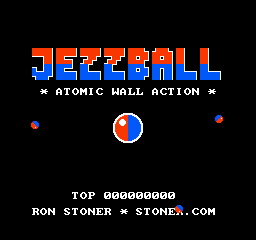
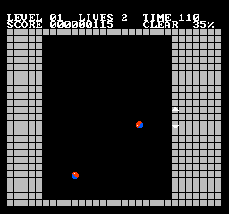
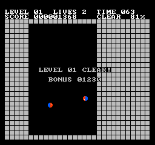
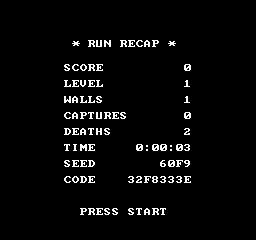

# JEZZBALL — NES

A fan tribute to JezzBall for the NES. JezzBall is copyrighted and owned by
its respective rights holders; this project shares no code or assets with
the original — all code, art, and music here are original work.

Pure 6502 assembly, mapper 0 (NROM), 16 KB PRG + 8 KB CHR, 60 fps.




Build walls to trap the bouncing atoms. A wall grows in two halves from the
cursor — red up/left, blue down/right. A half that reaches solid ground
turns to stone; a half touched by an atom is destroyed and costs a life.
Seal off an atom-free region and it fills in. Clear **75%** to advance.
More atoms every level, and the clock is always running.




Gameplay video with audio: [video/gameplay.mp4](video/jezzball-nes.mp4)

## Controls

| Button | Action |
| --- | --- |
| D-pad | Move cursor (hold to accelerate) |
| B | Toggle wall orientation ↕ / ↔ |
| A | Build a wall (clicking an atom costs a life) |
| Start | Pause |

## Build and run

Requires `cc65` and `python3`.

```sh
make          # build/jezzball.nes
make run      # launch in fceux
```

Tests (optional, `pip install nes-py pillow numpy` into `.venv`):

```sh
make test                             # smoke tests
.venv/bin/python tools/play_bot.py    # a bot that plays the game
.venv/bin/python tools/stress_test.py # 12-atom worst-case frame audit
```

## Competitive play

The game is built for score competition and runs are **verifiable**:

- After a game ends, the RUN RECAP screen shows score, stats, the RNG SEED,
  and an 8-hex CODE. Press Start to return to the title.
- The game is fully deterministic from power-on given the controller input,
  so a recorded run is its own proof. Record with fceux (File > Movie
  Recording) and submit the `.fm2` plus a photo of the recap screen.
- Anyone can check a claim:

```sh
.venv/bin/python tools/verify_run.py yourrun.fm2 --png replayed.png
```

The verifier replays the inputs against the ROM and prints the score, stats,
SEED, and CODE the recap must show, plus a checkpoint code per cleared level
(so long runs can be spot-checked level by level). The CODE is a CRC32
commitment binding the recap photo to one exact input sequence, not a
cryptographic signature. Forging it means finding inputs that actually
achieve the score, i.e. performing the run; distinguishing human play from
tool-assisted input remains a video question, as in all classic score
adjudication. Pin the ROM by its SHA-256 (the verifier prints it) when
comparing scores.

Score is 9 digits and saturates (never rolls over); the play clock is
marathon-safe. Levels cap at 99 and repeat; atoms cap at 12.

## Credits

JezzBall belongs to its rights holders.
